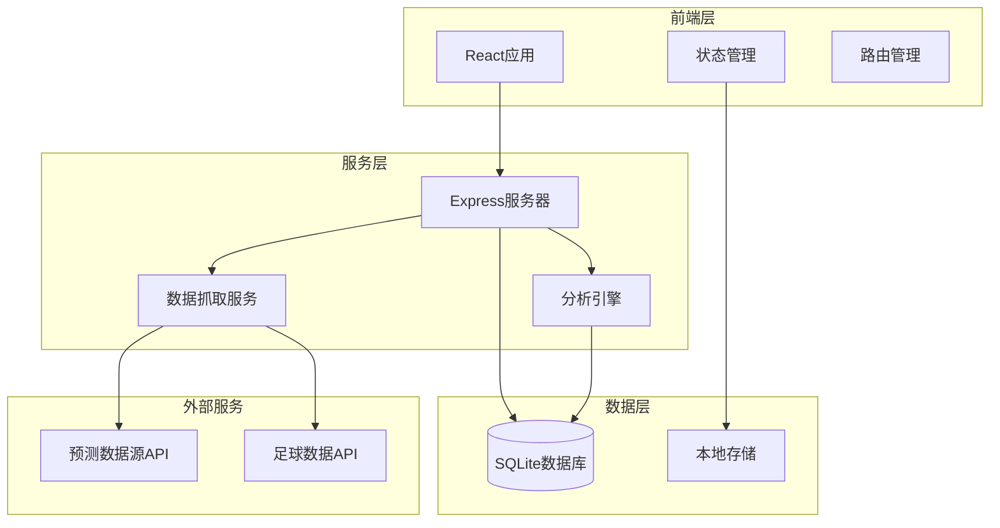
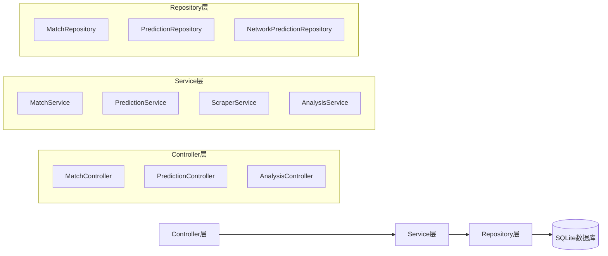
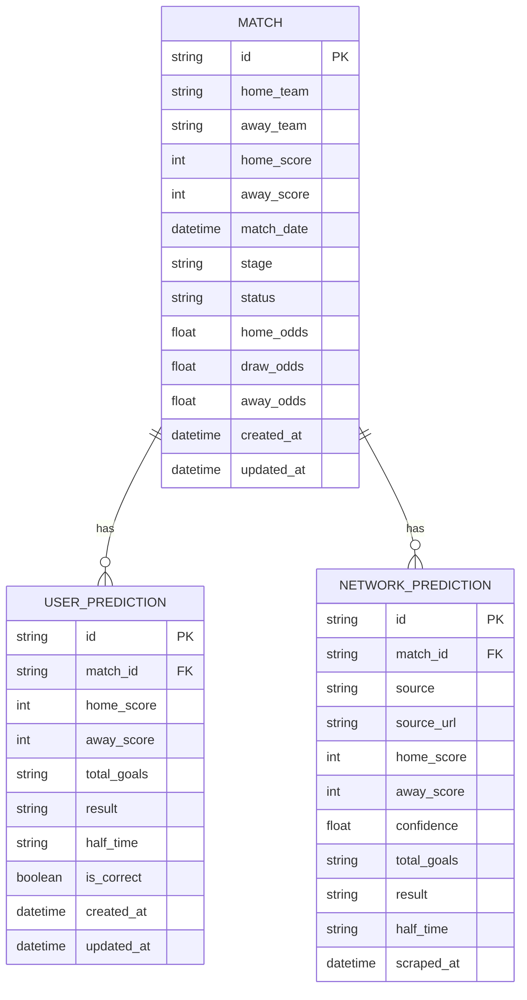

# 2026世界杯比分预测程序 技术架构文档

## 1. 架构设计



## 2. 技术说明

### 前端技术栈
- **框架**: React 18 + Vite
- **样式**: Tailwind CSS 3
- **路由**: React Router v6
- **图表**: Recharts（数据可视化）
- **状态管理**: React Context + useReducer
- **HTTP客户端**: Axios

### 后端技术栈
- **运行时**: Node.js
- **框架**: Express 4
- **数据库**: SQLite3（轻量级本地数据库）
- **数据抓取**: Cheerio（HTML解析）+ Axios
- **定时任务**: node-cron

### 开发工具
- **构建工具**: Vite
- **代码规范**: ESLint + Prettier
- **类型检查**: TypeScript

## 3. 路由定义

| 路由 | 用途 |
|------|------|
| `/` | 首页，重定向到比赛中心 |
| `/matches` | 比赛中心页，展示所有比赛列表 |
| `/matches/:id` | 比赛详情页，展示单场比赛信息和预测 |
| `/predictions` | 我的预测页，展示用户预测记录 |
| `/analysis` | 数据中心页，展示趋势分析 |
| `/settings` | 设置页（可选） |

## 4. API定义

### 4.1 比赛相关API

```typescript
// 获取比赛列表
GET /api/matches
Response: {
  matches: Array<{
    id: string;
    homeTeam: string;
    awayTeam: string;
    homeScore: number | null;
    awayScore: number | null;
    date: string;
    stage: string;
    status: 'upcoming' | 'live' | 'finished';
  }>;
}

// 获取单场比赛详情
GET /api/matches/:id
Response: {
  match: {
    id: string;
    homeTeam: string;
    awayTeam: string;
    homeScore: number | null;
    awayScore: number | null;
    date: string;
    stage: string;
    status: string;
    odds: {
      home: number;
      draw: number;
      away: number;
    };
  };
  predictions: Array<NetworkPrediction>;
}
```

### 4.2 预测相关API

```typescript
// 提交用户预测
POST /api/predictions
Body: {
  matchId: string;
  homeScore: number;
  awayScore: number;
  totalGoals: 'over' | 'under' | 'exact';
  result: 'home' | 'draw' | 'away';
  halfTime: 'home-home' | 'home-draw' | 'home-away' | 'draw-home' | 'draw-draw' | 'draw-away' | 'away-home' | 'away-draw' | 'away-away';
}
Response: {
  success: boolean;
  predictionId: string;
}

// 获取用户预测记录
GET /api/predictions/my
Response: {
  predictions: Array<{
    id: string;
    matchId: string;
    homeTeam: string;
    awayTeam: string;
    predictions: UserPrediction;
    actualResult: ActualResult | null;
    isCorrect: boolean | null;
    createdAt: string;
  }>;
  statistics: {
    total: number;
    correct: number;
    accuracy: number;
  };
}

// 获取网络预测数据
GET /api/predictions/network/:matchId
Response: {
  predictions: Array<{
    source: string;
    sourceUrl: string;
    homeScore: number;
    awayScore: number;
    confidence: number;
    totalGoals: string;
    result: string;
    halfTime: string;
    updatedAt: string;
  }>;
}
```

### 4.3 分析相关API

```typescript
// 获取对比分析
GET /api/analysis/compare/:matchId
Response: {
  userPrediction: UserPrediction;
  networkPredictions: NetworkPrediction[];
  analysis: {
    scoreSimilarity: number;
    resultAgreement: number;
    suggestedPrediction: SuggestedPrediction;
  };
}

// 获取趋势数据
GET /api/analysis/trends
Response: {
  trends: Array<{
    matchId: string;
    predictionTrend: {
      homeWinRate: number;
      drawRate: number;
      awayWinRate: number;
      avgHomeScore: number;
      avgAwayScore: number;
    };
  }>;
}
```

## 5. 服务器架构图



## 6. 数据模型

### 6.1 数据模型定义



### 6.2 数据定义语言（DDL）

```sql
-- 比赛表
CREATE TABLE matches (
    id TEXT PRIMARY KEY,
    home_team TEXT NOT NULL,
    away_team TEXT NOT NULL,
    home_score INTEGER,
    away_score INTEGER,
    match_date DATETIME NOT NULL,
    stage TEXT NOT NULL,
    status TEXT DEFAULT 'upcoming',
    home_odds REAL,
    draw_odds REAL,
    away_odds REAL,
    created_at DATETIME DEFAULT CURRENT_TIMESTAMP,
    updated_at DATETIME DEFAULT CURRENT_TIMESTAMP
);

-- 用户预测表
CREATE TABLE user_predictions (
    id TEXT PRIMARY KEY,
    match_id TEXT NOT NULL,
    home_score INTEGER NOT NULL,
    away_score INTEGER NOT NULL,
    total_goals TEXT NOT NULL,
    result TEXT NOT NULL,
    half_time TEXT NOT NULL,
    is_correct INTEGER,
    created_at DATETIME DEFAULT CURRENT_TIMESTAMP,
    updated_at DATETIME DEFAULT CURRENT_TIMESTAMP,
    FOREIGN KEY (match_id) REFERENCES matches(id)
);

-- 网络预测表
CREATE TABLE network_predictions (
    id TEXT PRIMARY KEY,
    match_id TEXT NOT NULL,
    source TEXT NOT NULL,
    source_url TEXT,
    home_score INTEGER NOT NULL,
    away_score INTEGER NOT NULL,
    confidence REAL,
    total_goals TEXT,
    result TEXT NOT NULL,
    half_time TEXT,
    scraped_at DATETIME DEFAULT CURRENT_TIMESTAMP,
    FOREIGN KEY (match_id) REFERENCES matches(id)
);

-- 索引
CREATE INDEX idx_matches_date ON matches(match_date);
CREATE INDEX idx_matches_status ON matches(status);
CREATE INDEX idx_user_predictions_match ON user_predictions(match_id);
CREATE INDEX idx_network_predictions_match ON network_predictions(match_id);
```

## 7. 数据抓取策略

### 7.1 数据源
- 官方比赛数据：使用足球数据API（如football-data.org或类似API）
- 预测数据：从多个体育预测网站抓取（需要遵守robots.txt和使用条款）
  - ESPN预测
  - 体育门户网站专家预测
  - 社交媒体数据分析

### 7.2 抓取频率
- 比赛数据：每6小时更新一次
- 网络预测：比赛前24小时内每2小时更新一次
- 比赛当天：每小时更新一次

### 7.3 数据处理流程
1. 抓取原始数据
2. 数据清洗和标准化
3. 存储到数据库
4. 触发分析引擎更新